# книжный магазин с системой рекомендаций

учебный проект книжного магазина с backend на spring boot, frontend на react, базой данных postgresql и кэшем redis.

## содержание

1. описание проекта  
2. описание предметной области и основных сущностей  
3. сравнительный анализ аналогичных решений  
4. обоснование целесообразности и актуальности  
5. описание акторов  
6. use-case диаграмма  
7. er-диаграмма  
8. пользовательские сценарии  
10. бизнес-процессы (bpmn)  
11. тип приложения и технологический стек  
12. c4-диаграммы  
13. диаграммы последовательностей  
14. схема базы данных  
15. схемы алгоритмов функций  
16. исследовательская часть  

## 1. описание предметной области и основных сущностей

предметная область — онлайн-магазин книг с персональными рекомендациями.

основные сущности:
- **пользователь** (user) — человек с аккаунтом в системе;
- **книга** (book) — доступная к покупке книга;
- **автор** (author) — автор книги;
- **категория** (category) — жанр или раздел;
- **издательство** (publisher) — издательство книги;
- **отзыв** (review) — оценка и комментарий к книге;
- **заказ** (order) — покупка одной или нескольких книг;
- **позиция заказа** (orderitem) — одна книга в заказе с количеством и ценой;
- **список желаемого** (wishlist) — книги, которые пользователь хочет купить позже;
- **история просмотров** (readinghistory) — какие страницы книг смотрел пользователь.

## 2. описание акторов (ролей)

| актор | описание |
|---|---|
| **гость** (guest) | пользователь без аккаунта. может смотреть каталог, страницы книг, читать отзывы и пользоваться поиском. персонализированные рекомендации, а также заказы недоступны. |
| **покупатель** (customer) | зарегистрированный пользователь. может заказывать книги, оставлять отзывы, получать персонализированные рекомендации и вести список желаемого. |
| **модератор** (moderator) | сотрудник платформы. в дополнение к правам покупателя может редактировать карточки книг, удалять нарушающие правила отзывы и смотреть общую статистику. |
| **администратор** (admin) | полный доступ ко всему: управление пользователями, ролями, каталогом, категориями, издательствами и авторами, сброс кэша, просмотр журнала действий. |

## 3. use-case диаграмма

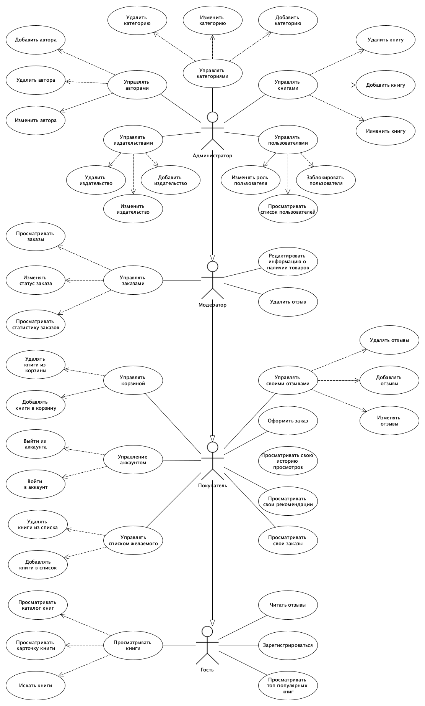

## 4. er-диаграмма

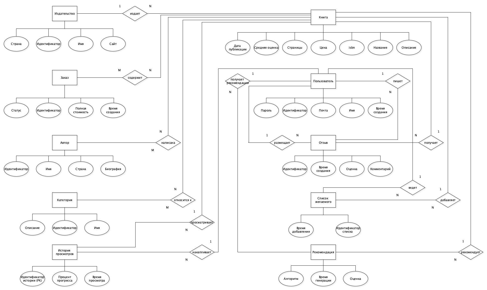

## 5. пользовательские сценарии

### сценарий 1: покупатель находит и заказывает книгу по рекомендации

**актор:** покупатель (авторизован)  
**предусловие:** пользователь ранее оставил несколько отзывов и совершил покупки.  
**основной поток:**

1. пользователь открывает раздел «рекомендации».
2. система анализирует историю оценок и покупок пользователя и формирует персонализированный список книг.
3. пользователь видит список рекомендованных книг с краткими аннотациями.
4. пользователь выбирает книгу и переходит на её карточку.
5. читает описание и отзывы других покупателей.
6. нажимает «заказать».
7. система регистрирует новый заказ со статусом «в обработке».

**постусловие:** создан заказ, рекомендации при следующем обращении обновляются с учётом новой покупки.

### сценарий 2: покупатель оставляет отзыв на книгу

**актор:** покупатель (авторизован)  
**предусловие:** пользователь уже получил и прочитал заказанную книгу.  
**основной поток:**

1. пользователь открывает карточку книги и переходит в раздел «отзывы».
2. заполняет форму: выбирает оценку (1–5 звёзд) и вводит текстовый комментарий.
3. отправляет отзыв.
4. система проверяет, оставлял ли пользователь отзыв на эту книгу ранее:
   - нет — создаёт новый отзыв и пересчитывает средний рейтинг книги;
   - да — обновляет существующий отзыв и пересчитывает рейтинг.
5. отзыв появляется в списке на странице книги.

**постусловие:** отзыв сохранён, средний рейтинг книги обновлён, рекомендации пересчитываются при следующем обращении.

### сценарий 3: модератор удаляет нарушающий отзыв

**актор:** модератор  
**предусловие:** поступила жалоба на отзыв с оскорбительным содержанием.  
**основной поток:**

1. модератор переходит в раздел управления отзывами.
2. находит отзыв, нарушающий правила сервиса.
3. нажимает «удалить отзыв» и подтверждает действие.
4. система удаляет отзыв и пересчитывает средний рейтинг затронутой книги.
5. модератор получает подтверждение об успешном удалении.

**постусловие:** отзыв удалён, рейтинг книги пересчитан, рекомендации обновляются при следующем обращении.

### сценарий 4: администратор сбрасывает устаревшие рекомендации

**актор:** администратор  
**предусловие:** в каталог добавлено большое количество новых книг, ранее сформированные рекомендации устарели.  
**основной поток:**

1. администратор переходит в раздел управления системой.
2. нажимает «сбросить кэш рекомендаций».
3. система аннулирует ранее сохранённые рекомендации.
4. администратор получает подтверждение операции.
5. при следующем обращении система формирует рекомендации заново с учётом актуального каталога.

**постусловие:** устаревшие рекомендации удалены, пользователи получают актуальные персонализированные подборки.

## 10. бизнес-процессы (bpmn)

### процесс 1: формирование рекомендаций
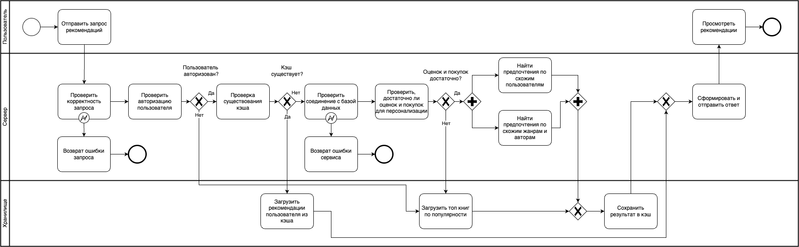

### процесс 2: оформление и обработка заказа
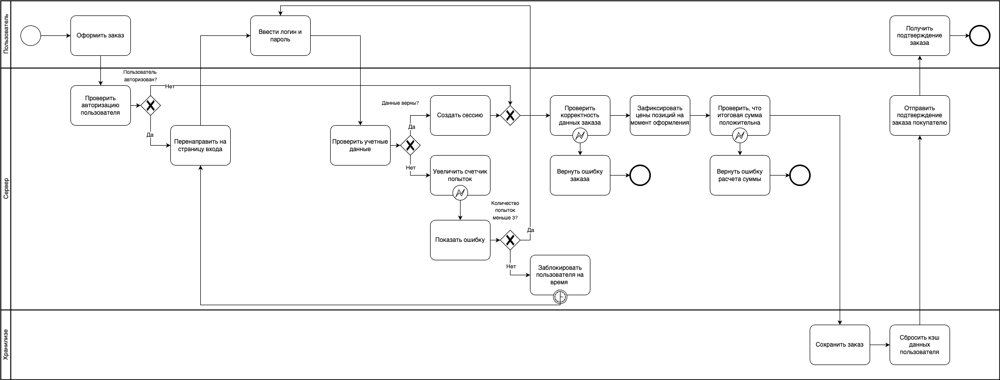

## стек
- backend: java 17, spring boot 3, spring security, spring data jpa;
- база данных: postgresql 15;
- кэш: redis 7;
- frontend: react 18 + typescript.

## 12. c4

### l1
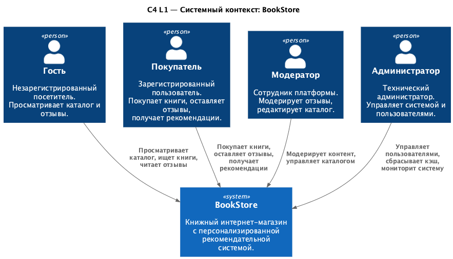

### l2
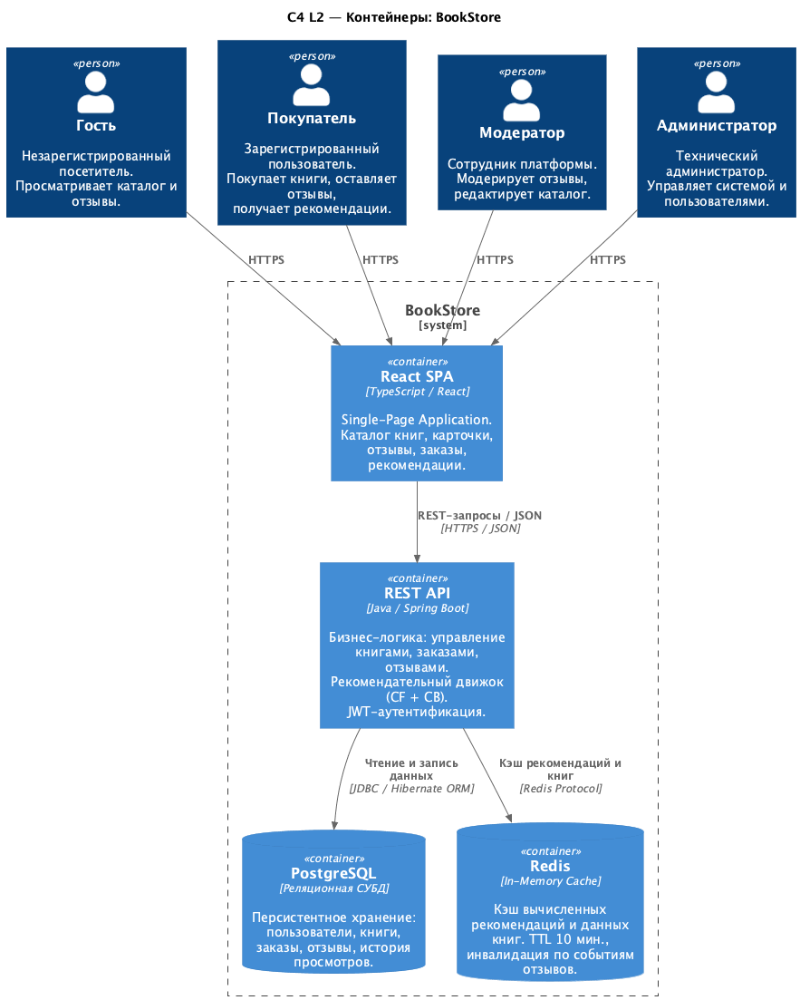

### l3
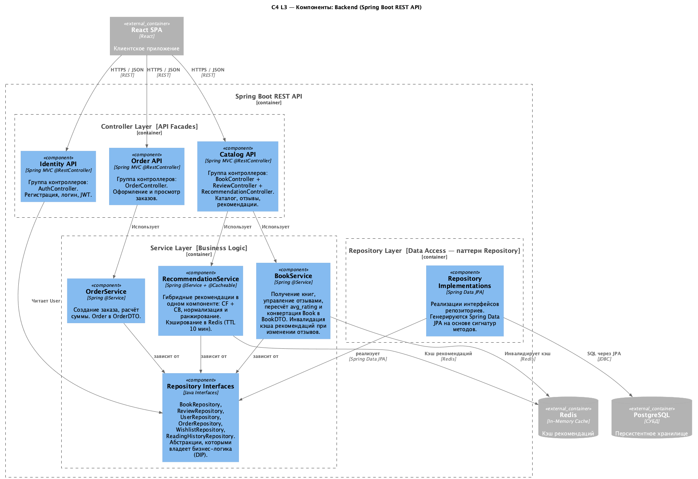

### l4 repository
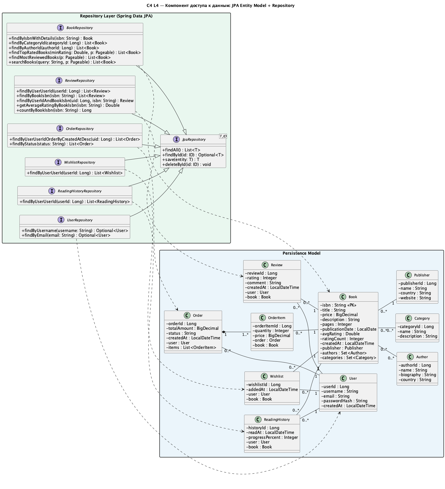

### l4 services
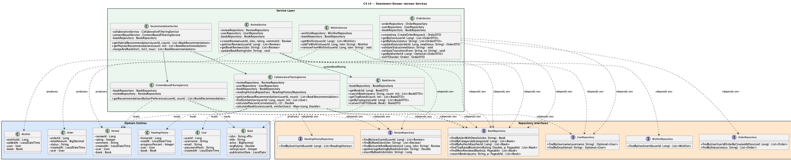

## 13. диаграммы последовательностей

### формирование персональных рекомендаций
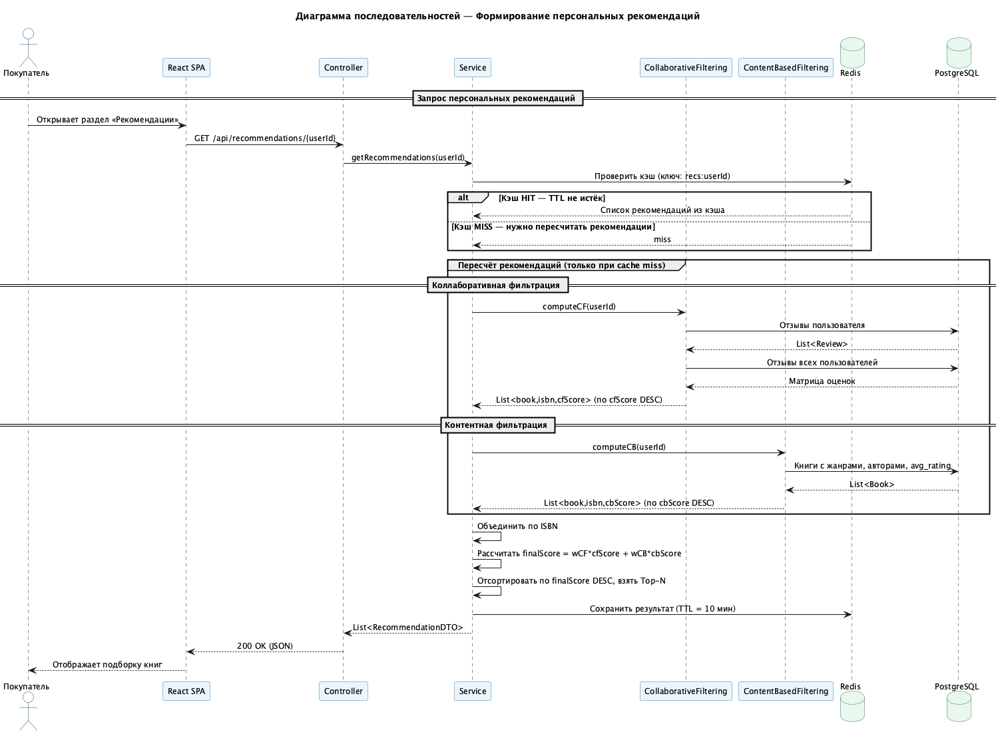

### оформление и обработка заказа
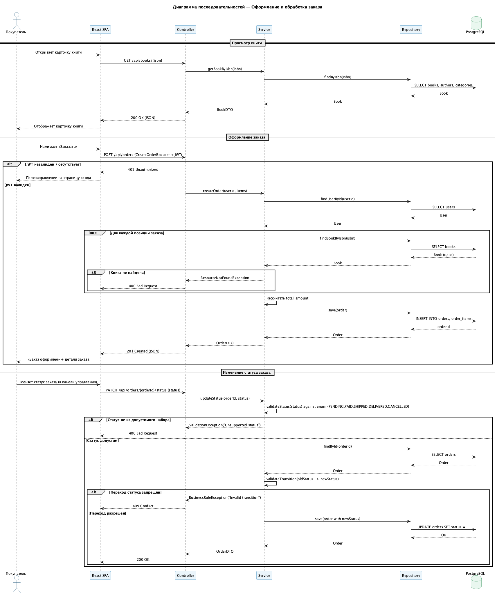

## 14. схема базы данных

субд: **postgresql**.
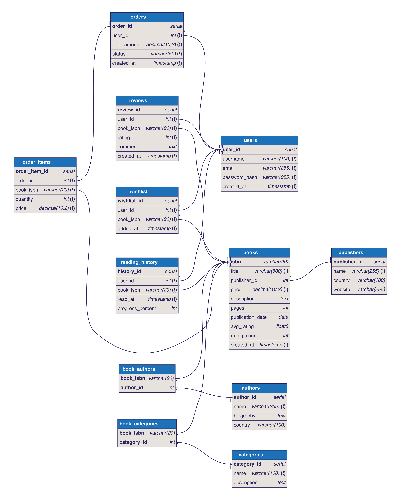

## 15. схемы алгоритмов функций

### create interaction on rating
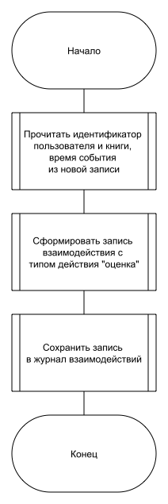

### update product by rating
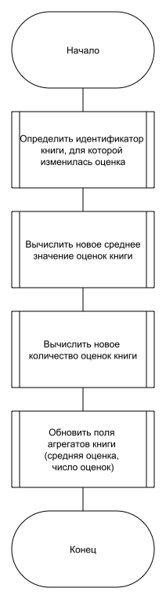

### calculate recommendations
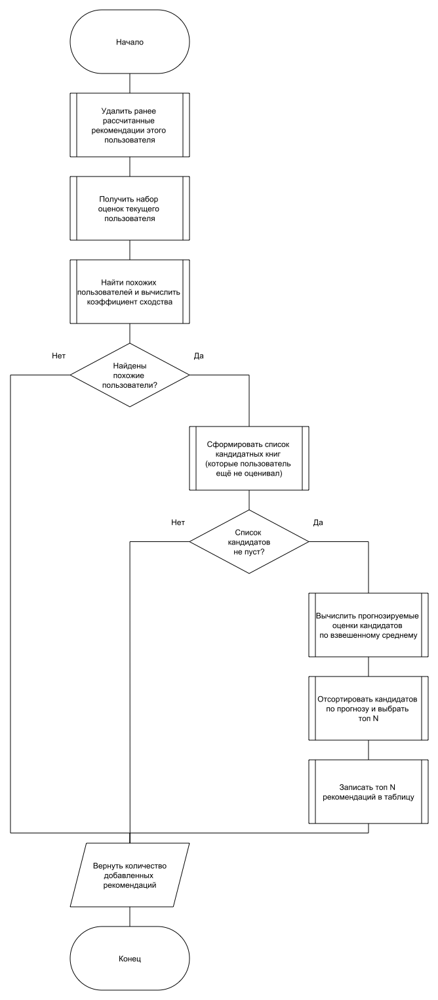

### get popular products by category
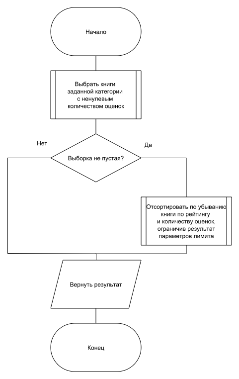

### get user statistics
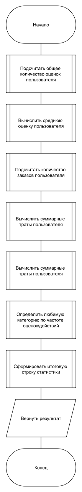

## 16. исследовательская часть

### постановка исследования

для измерений формируется набор данных, переключаются конфигурации индексов, запускаются серии измерений и сохраняются результаты вместе с планами `explain analyze`.

после подготовки объём данных составил:
- `users` — 1000 строк;
- `reviews` — 29480;
- `orders` — 30000;
- `order_items` — 30000.

сравнивались варианты: без индексов, простые, составные, простые с составными, избыточные.

простые индексы строились для столбцов `category_id`, `user_id`, `created_at`, `avg_rating`, `order_id`, `publisher_id`.
составные — для наборов `(category_id, book_id)`, `(user_id, rating)`, `(user_id, status, created_at)`, `(book_id, rating)`.
избыточный набор добавлял индексы для `price`, `created_at`, `total_amount`.

набор измеряемых запросов:
1. топ книг по категории (q1);
2. отзывы пользователя с сортировкой по рейтингу (q2);
3. заказы пользователя по дате (q3);
4. агрегированная статистика рейтингов по категории (q4);
5. история заказов пользователя с `join` по позициям (q5);
6. запись: вставка заказа и позиции (с откатом транзакции) (q6).

для каждой пары «запрос-конфигурация» выполнялись 20 начальных и 250 измеряемых запусков.
перед сериями выполнялись пересоздание индексов по конфигурации и `analyze`.

### результаты исследования

сводные метрики времени выполнения, мс:

| конфигурация индексов | среднее время чтения | среднее время записи |
|---|---:|---:|
| без индексов | 1.7253 | 1.6040 |
| простые индексы | 1.0185 | 1.4976 |
| составные индексы | 1.2883 | 1.6045 |
| простые и составные индексы | 1.0202 | 1.4863 |
| избыточная индексация | 1.0451 | 1.4918 |

график среднего времени выполнения запросов `q1-q6`:

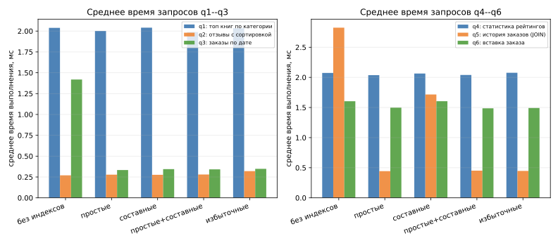

график зависимости среднего времени выполнения от числа индексов:

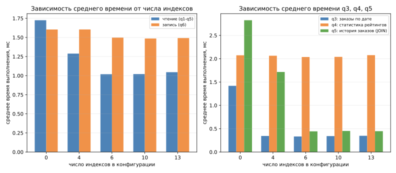

для запроса истории заказов с `join` в плане без индексов наблюдаются последовательные сканирования, а в вариантах с простыми индексами — чтение по индексам. это согласуется со снижением времени в измерениях.

### вывод

минимальное среднее время чтения получено для простых индексов — 1.0185 мс, для набора «простые и составные индексы» — 1.0202 мс, без индексов — 1.7253 мс.
для записи минимальное среднее время составило 1.4863 мс при наборе «простые и составные индексы», без индексов — 1.6040 мс.

для данной реализации выбран набор «простые и составные индексы», так как он обеспечивает близкое к минимальному время чтения и наилучшее время записи среди всех измеренных конфигураций.

## команды

- запуск: `./code/run.sh start`
- остановка: `./code/run.sh stop`
- логи: `./code/run.sh logs`
- заполнение тестовыми данными: `./code/run.sh seed`

